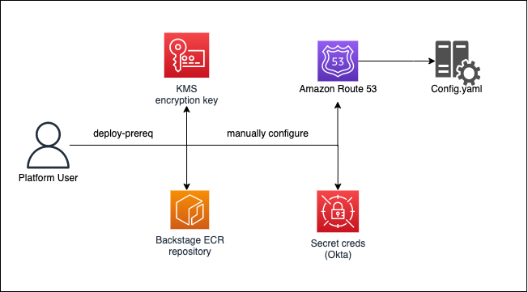

# App Development for Backstage<!-- -->.io on AWS Infrastructure Setup

## Solution Structure

The AWS Backend is composed of three-steps/stacks installation. The reason for that is due to the external dependencies on other infrastructure that needs to be configured, such as: Okta. The steps below provide instruction and guidance about the architecture.

### 1. Prerequisites

1. Edit `infrastructure/config.yaml`
    - AppPrefix - a prefix name that will be added to the created cloud artifacts
    - Account - the account to deploy the solution
    - Region - the region to deploy the solution
    - ReplicaRegion - a replica region to deploy secrets replicas
    - OktaConfigSecret - the name of the secret for storing Okta configurations
    - DbConfigSecret - the name of the secret for storing database credentials used by the Backstage solution
    - GitLabSecret - the name of secret for storing GitLab credentials
    - GitLabAmi - the AMI for the GitLab EC2 image
    - R53HostedZoneName - the hosted zone which will be used to deploy the solution along with its subdomains
    - AllowedIPs - a list of CIDR blocks that will be allowed to access the solution externally

2. CDK bootstrap - make sure the account, region, and replica region are all bootstrapped before continuing to the next steps. You can bootstrap the account by simply running the command below:

```sh
cdk bootstrap aws://$ACCOUNT_ID/$AWS_PRIMARY_REGION
cdk bootstrap aws://$ACCOUNT_ID/$AWS_SECONDARY_REGION
```

3. Run the prereq stack deployment 

```sh
make deploy-prereq
```

This command will deploy the pre-requisite stack which will create the following resources:

- **ECR repository** to hold Backstage container images.

- **KMS** key used for all data at rest encryption of Backstage platform resources.

- **Okta Secret** that will hold Okta confiugration and credentails to be used as an authentication provider for Backstage.

- **GitLab Secret** to store GitLab admin account credentials.

4. Configure the hosted zone

You will need to manually [create a hosted zone using **Amazon Route 53**](https://docs.aws.amazon.com/Route53/latest/DeveloperGuide/CreatingHostedZone.html) and update the domain in the config.yaml.

5. Update the Okta secret
You will need to update your Okta secrets in **Secrets Manager** with 3rd party Okta credentials and API tokens. Go to the AWS Console -> Secrets Manager-> locate Okta secret -> edit and update the preconfigured keys. Configuration is based on the usage of the RoadieHQ Okta module.  See the [documentation for the @roadiehq/catalog-backend-module-okta plugin](https://github.com/RoadieHQ/roadie-backstage-plugins/tree/main/plugins/backend/catalog-backend-module-okta) for details about the plugin.



### 2. Backstage image build and deploy
You will need to build a container image of Backstage with our new configurations.  Prior to building the container image, ensure that you have completed all configuration changes to add the Backstage-plugins functionality to your Backstage application.  See [PLUGIN_INSTALL.md](../docs/PLUGIN_INSTALL.md) for details.

**STOP HERE** 

Before continuing, make sure you have a Backstage directory at the root of the repo with a copy of Backstage software along with the plugins and coniguration changes, Please make sure you follow the instructions [Here](../README.md)

* Make sure you have Docker installed
* Make sure Docker is running

run the command below:

```sh
make build-and-deploy-Backstage-image
```

### 3. Deploy the solution stack

Before executing the command below, make sure you follow the prerequisite steps, Backstage image build and deploy, and that the config.yaml is up to date.
run the command below:
```sh
make deploy-solution
```

### 4. Deploy the GitLab CICD Runner stack

Before executing the command below, make sure that GitLab is up and running by opening a browser tab and navigating to the GitLab Web console. If the console comes up, you are ready to deploy the GitLab Runner stack by executing the command below:

```sh
make deploy-gitlab-runner
```

### 5. Validating the solution
Try to access the solution by using the hosted zone in the config.yaml. 

The root domain -> `<HOSTEDZONE>` is reserved for the custom Backstage image we created (Backstage platform).

The `git.<HOSTEDZONE>` is reserved for accessing the GitLab instance

**If you have issues with accessing the above, please make sure your security groups are up to date and that the task/ec2 are running.

### 6. Deploy the Backstage reference repository

The next step is to deploy the GitLab reference repo to the new GitLab instance. 
The reference repo will contain:

1. /templates → our pre-created AWS Apps templates.

2. /catalog → Entities - AWS Environment, AWS Environment Providers

3. /common → our cdk stack sets that are used by the templates

```sh
make create-Backstage-reference-repo
```

### 7. Restart the Backstage ECS service

Lastly - to accommodate all the changes above, please login to the AWS ECS console and restart/kill Backstage tasks to reload the application with all of the required reference data.

At this point, you should be able to login to Backstage using your {{route53DNSName}} in your browser. Make sure the security group of the Backstage loadbalancer allows access from your IP.
Once on the main screen, use your Okta credentials to connect to Backstage.

